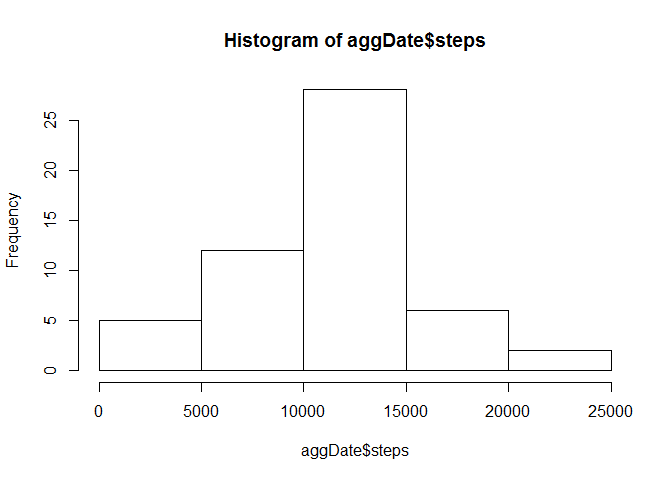
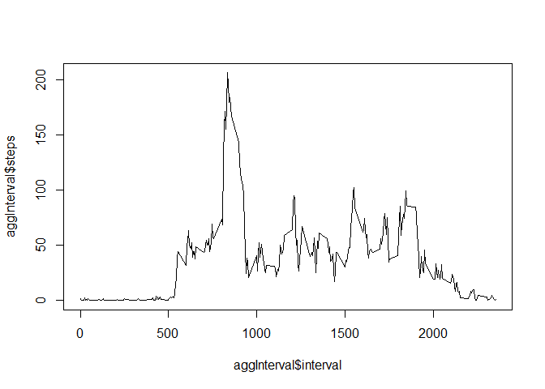
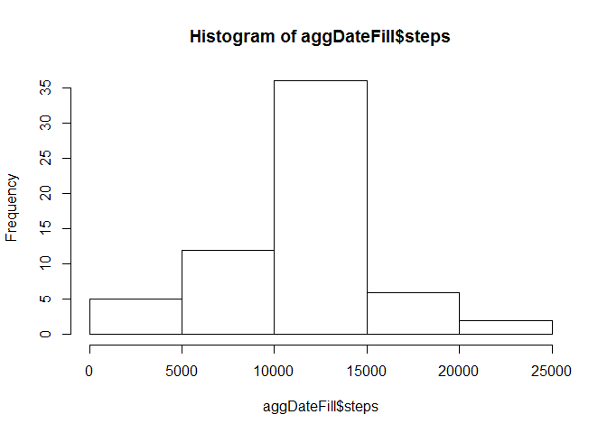
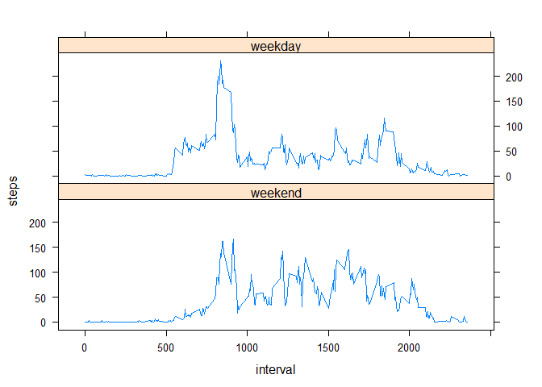

Loading and preprocessing the data
----------------------------------

The only prep work required for this data with exception of handling
nulls which occurs latter in the assignment is to read in the data from
a CSV. This section also installs the package required for latter
plotting.

    library(lattice)

    rawData <- read.csv("activity.csv")

What is mean total number of steps taken per day?
-------------------------------------------------

Calculate the total number of steps taken per day

1.  Calculate the total number of steps taken per day

This code groups the step totals by day and then renames the columns for
better readability

      aggDate <- aggregate(rawData$steps, by = list(rawData$date), FUN = sum)
      colnames(aggDate)<-c("date" , "steps")

1.  Make a histogram of the total number of steps taken each day

<!-- -->

      hist(aggDate$steps)

1.  Calculate and report the mean and median of the total number of
    steps taken per day

<!-- -->

    ##Mean
      mean(aggDate$steps,na.rm = TRUE)

    ## [1] 10766.19

    ##Median
      median(aggDate$steps,na.rm  =TRUE)

    ## [1] 10765

What is the average daily activity pattern?
-------------------------------------------

1.  Make a time series plot (i.e. type = "l") of the 5-minute
    interval (x-axis) and the average number of steps taken, averaged
    across all days (y-axis) This code groups steps into 5 minute
    intervals and calculates the average and then plots it on a line
    plot

<!-- -->

     aggInterval <- aggregate(rawData$steps, by = list(rawData$interval), FUN = mean,na.rm = TRUE)
      
      colnames(aggInterval)<-c("interval" , "steps")
      
      ##LinePlot
      plot(x = aggInterval$interval,y = aggInterval$steps, type = 'l' )

1.  Which 5-minute interval, on average across all the days in the data
    set, contains the maximum number of steps?

<!-- -->

      ##Interval With Max Avg steps
      maxInt = subset(aggInterval, steps== max(steps))
      maxInt$interval

    ## [1] 835

Imputing missing values
-----------------------

1.  Calculate and report the total number of missing values in the data
    set (i.e. the total number of rows with NAs)

<!-- -->

     ##Number of NA rows
      nrow(subset(rawData,is.na(rawData$steps)==TRUE))

    ## [1] 2304

1.  Devise a strategy for filling in all of the missing values in the
    data set. In this code I chose to fill in missing values with the
    average for that 5 minute interval.

2.  Create a new data set that is equal to the original data set but
    with the missing data filled in.

<!-- -->

      ##FIll in NA
      
      fillData <- rawData
      
      fillData = merge(x=fillData, y = aggInterval,by.x  = c('interval'),by.y  = c('interval'),all.X = TRUE)
      
      colnames(fillData)<-c("interval" , "steps","date","AvgSteps")
      
      ##Data filled in using the average for that interval 
      fillData$steps[is.na(fillData$steps)]<-fillData$AvgSteps[is.na(fillData$steps)]

1.  Make a histogram of the total number of steps taken each day and
    Calculate and report the mean and median total number of steps taken
    per day. Do these values differ from the estimates from the first
    part of the assignment? What is the impact of imputing missing data
    on the estimates of the total daily number of steps?

<!-- -->

      aggDateFill <- aggregate(fillData$steps, by = list(fillData$date), FUN = sum)
      
      
      colnames(aggDateFill)<-c("date" , "steps")
      
      
      hist(aggDateFill$steps)

      mean(aggDateFill$steps,na.rm = TRUE)

    ## [1] 10766.19

      median(aggDateFill$steps,na.rm  =TRUE)

    ## [1] 10766.19

The mean changes not at all because I have used an average value to fill
in the missing amounts so it counteracts itself. The Median moved to the
mean because there were more instances of that value appearing then used
to be present. mitigating outliers

Are there differences in activity patterns between weekdays and weekends?
-------------------------------------------------------------------------

1.  Create a new factor variable in the data set with two levels -
    "weekday" and "weekend" indicating whether a given date is a weekday
    or weekend day.

<!-- -->

     ##FIll data by day of week
      fillData$doW<-weekdays(as.Date(fillData$date))
      
      weekDaysList <- c('Monday', 'Tuesday', 'Wednesday', 'Thursday', 'Friday')
      
      fillData$weekday = factor((fillData$doW %in% weekDaysList), levels=c(FALSE, TRUE), labels=c('weekend', 'weekday'))
      
      
      
      aggFillInterval <- aggregate(fillData$steps, by = list(fillData$interval,fillData$weekday), FUN = mean,na.rm = TRUE)
      
      colnames(aggFillInterval)<-c("interval" ,"weekday", "steps")

Make a panel plot containing a time series plot of the 5-minute interval
(x-axis) and the average number of steps taken, averaged across all
weekday days or weekend days (y-axis).

      ##LinePlot
      with(aggFillInterval, xyplot(steps~interval | weekday, type = 'l' , layout = c(1,2,1) ))

